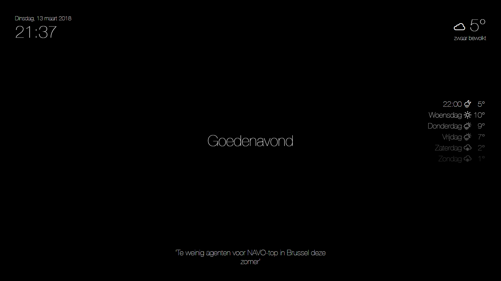

# Specular Smart Mirror
Project for powering a magic mirror

## Current features
- Current Date / Time 
- Display news headlines
- Current weather from OpenWeatherMap
- Weather forecast from OpenWeatherMap
- Formula 1 standings and upcoming grand prix counter
- Today's xkcd comic
- Google calendar upcoming events
- Random animated gifs
- Gesture control using a APDS9960 gesture sensor module
- Fokke en Sukke cartoon
- Atag One status 
- Solar Edge solar panels status

## Dependencies
- Express
- Vue
- Axios
- Skeleton-css
- Open weather icons
- Webpack
